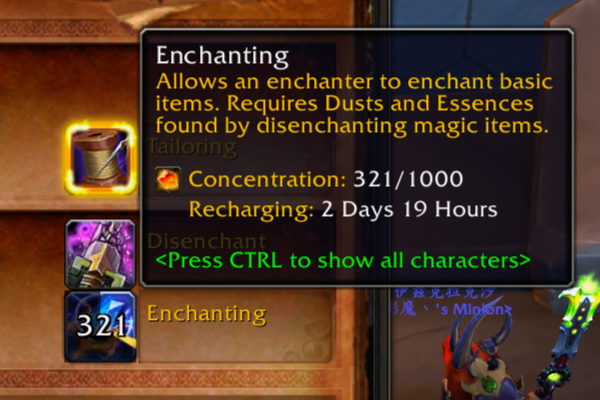
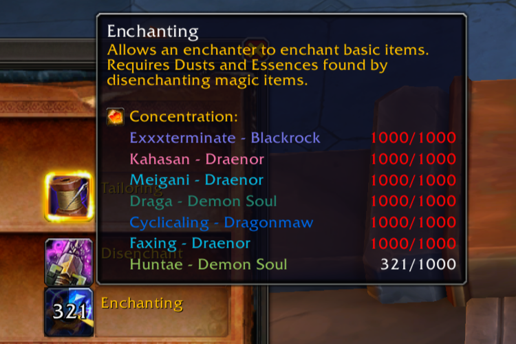

# ConcentrationRecharge

> Displays Concentration recharge status directly on profession spell icons and tooltips.

**ConcentrationRecharge** simplifies tracking the Concentration by displaying the recharge status directly on profession spell icons and tooltips. Eliminates the need to open Profession Book to monitor Concentration regeneration.

## Features
- **Intuitive Concentration Display**: Displays current Concentration recharge directly on profession icons and tooltips
- **Zero Configuration**: Works out-of-the-box after installation
- **Multi-Characters Support**: Track all your characters' Concentration
- **Minimal UI Impact**: Fit to native UI